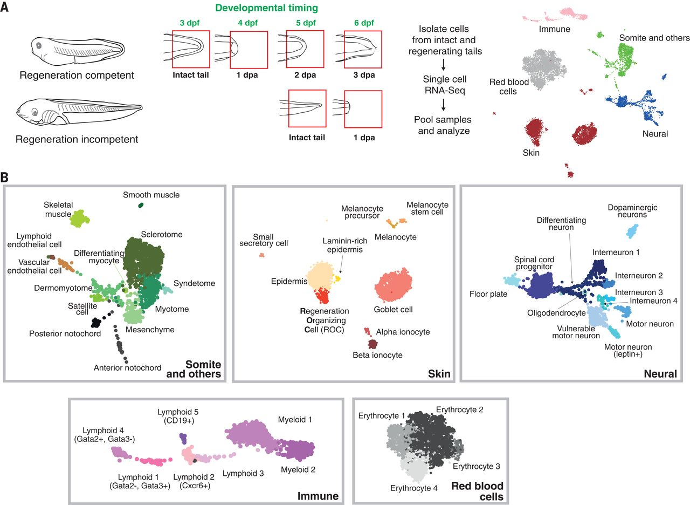

# Applied Data Science @ Columbia
## Fall 2024
## Project 1: Find the frog’s source of regenerative power



### [Project Description](doc/Proj1_desc.md)

Term: Fall 2024

+ Projec title: Find the frog's source of regenerative power
+ This project is conducted by Jiahui Zhu

+ Project summary: [a short summary] 

This folder is orgarnized as follows.

```
proj/
├── notebook/
├── doc/
├── fig/
└── output/
```

Please see each subfolder for a README file.
